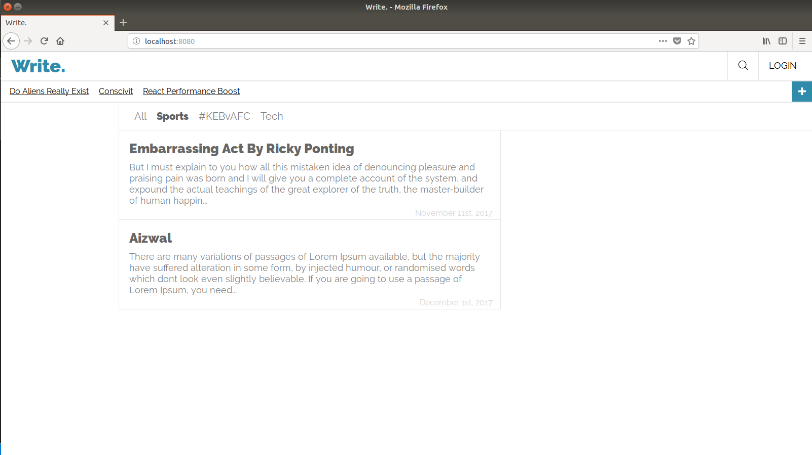
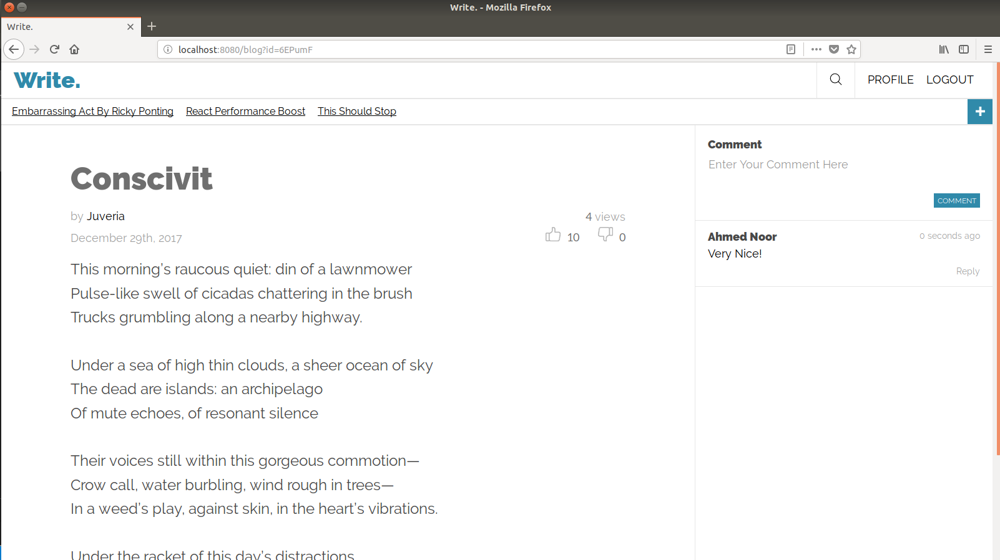
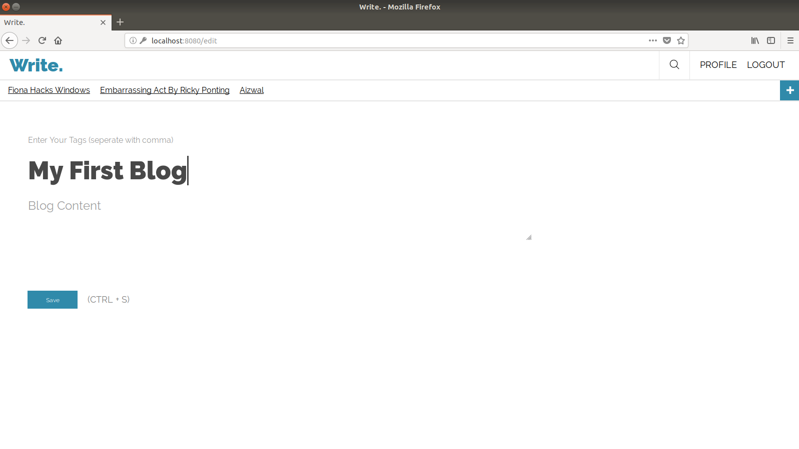
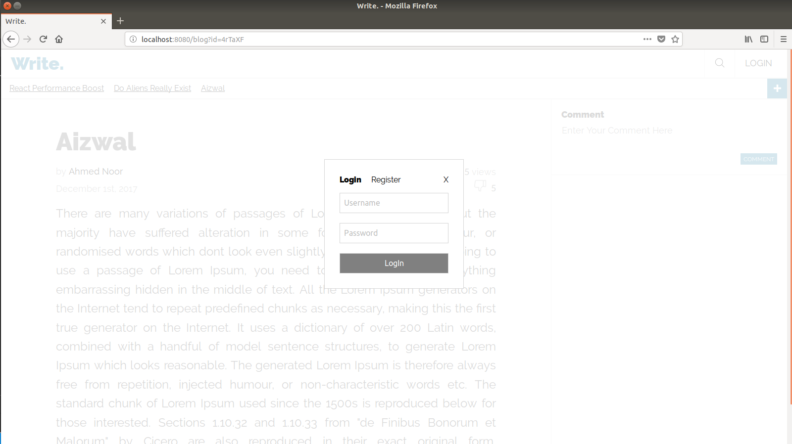
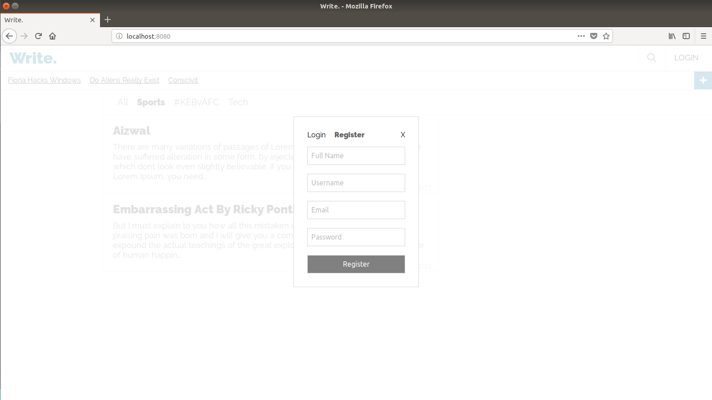
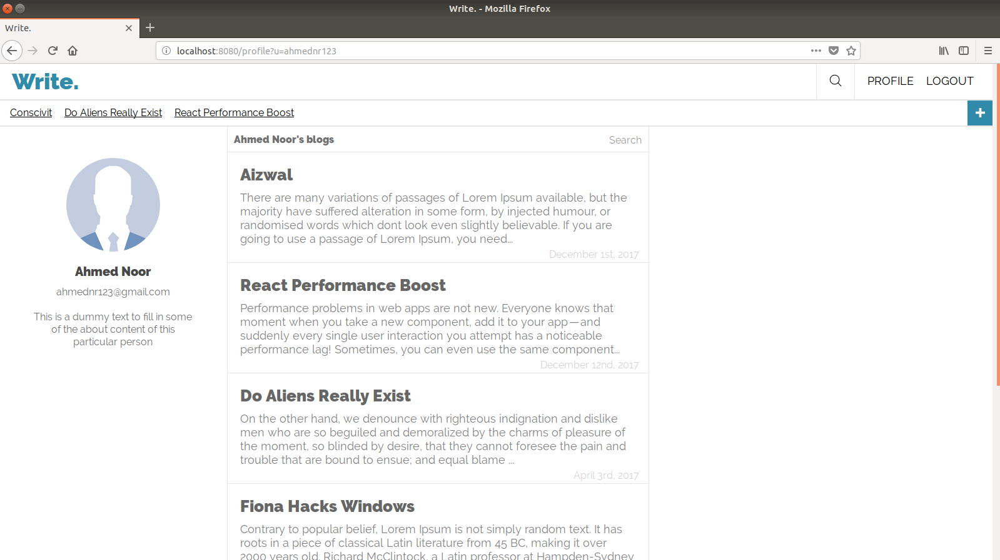

# Write - Database management Project

A simple web application to provide a platform for users to write their blogs.

## Setting up
  - Mysql Server
  - Redis Server
  - Install npm packages:
    `npm install`
  - Run application:
    `node app`

## Screenshots

### Home

### Blog

### New Blog

### Login

### Register

### Profile

